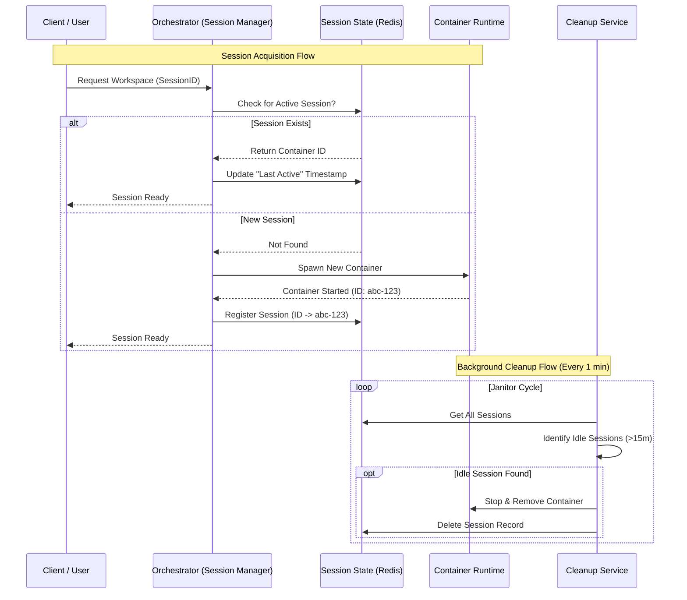

# Business Logic & Flow

## Executive Summary
The **MCP Orchestrator** serves as a secure, ephemeral runtime environment for AI Model Context Protocol (MCP) servers. It allows users to instantiate isolated workspaces (Docker containers) on-demand to execute tools safely. The system manages the lifecycle of these workspaces, ensuring they persist during active usage and are automatically recycled after periods of inactivity to optimize resource usage.

## Core Capabilities
*   **On-Demand Isolation:** Users are provisioned a dedicated, sandboxed environment (Docker container) upon request.
*   **Session Persistence:** The system "remembers" a user's workspace, allowing them to reconnect and continue executing tools without state loss within a session window.
*   **Automated Housekeeping:** A "Janitor" process continuously monitors for abandoned sessions, freeing up compute and memory resources by terminating workspaces that have been idle for more than 15 minutes.
*   **Secure Communication:** All communication between the host and the isolated workspace occurs via standard input/output streams, avoiding open network ports.

## Business Process Flow

