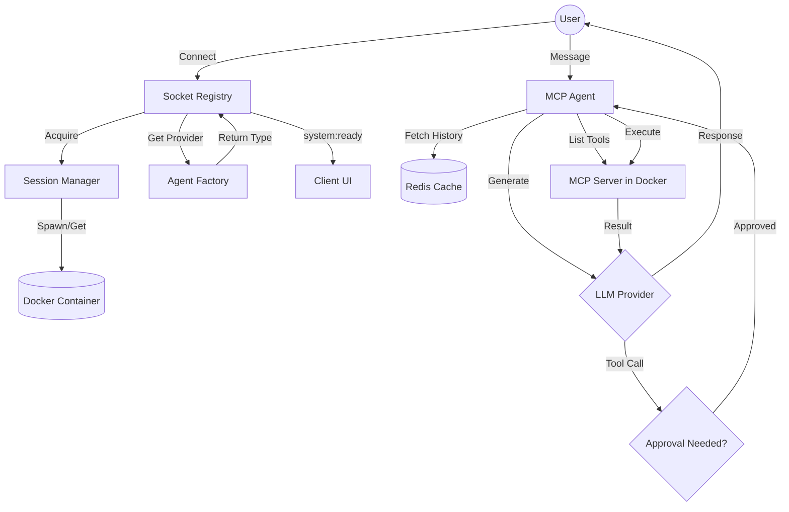

# Business Flow: MCP Orchestrator

## Overview
The MCP Orchestrator is a middleware service that enables Large Language Models (LLMs) to interact with isolated environments via the Model Context Protocol (MCP). It manages user sessions, persists conversation history, and coordinates the execution of tools within ephemeral Docker containers.

## Stakeholder Journey
1. **Page Load & Model Detection**:
    - User navigates to `http://localhost:3000`
    - Loading screen appears: "Preparing MCP Orchestrator..."
    - System makes API calls to test which models are available with configured API key (~5-10s)
    - Model dropdown populates with only accessible models

2. **Model Selection** (Optional):
    - User can select preferred model from dropdown (e.g., Claude Sonnet 4.5, Opus 4.6, Haiku 4.5)
    - Changing model triggers reconnection with new model configuration
    - Conversation history resets when switching models

3. **User Connection**: A user connects via WebSockets, providing a unique `sessionId` and optional `model` parameter.

4. **Environment Provisioning**: The system acquires a dedicated Docker container for the session. If the container doesn't exist, it is spawned automatically with the MCP server.

5. **Agent Personalization**:
    - The system determines the active `LLM_PROVIDER` and selected model
    - It informs the client UI via the `system:ready` event with `{ provider, model }`
    - The client UI updates its branding and model selector

6. **Conversational Loop**:
    - User sends a prompt
    - Agent retrieves conversation history from Redis
    - Agent discovers available tools (read_file, write_file, list_files, execute_command) within the Dockerized MCP server
    - LLM generates a response or requests a tool execution

7. **Human-in-the-Loop (HITL)**: If a tool execution is requested, the system pauses for user approval.

8. **Tool Execution**: Upon approval, the tool is executed inside the secure container (no network, 512MB RAM, 0.5 CPU), and results are fed back to the LLM.

## Logical Flow Chart

