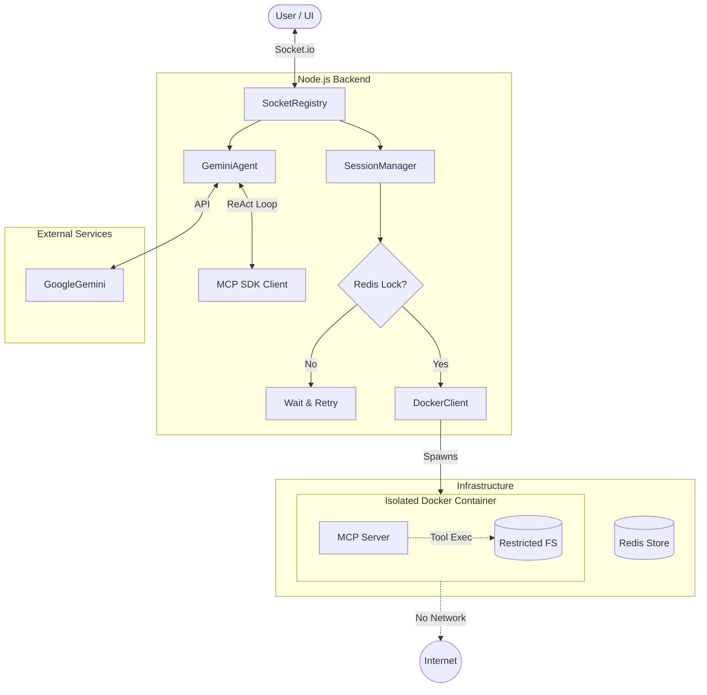

# Business Flow & Stakeholder Overview

## Narrative Overview
The **MCP Orchestrator** is a secure execution environment for AI agents. It bridges high-level reasoning from Google's Gemini model with low-level tool execution in isolated Docker containers.

1.  **Session Acquisition**: When a user connects, the system retrieves or creates a session. To prevent resource duplication, it uses a **Distributed Lock** (Redis) to ensure only one container is spawned per session ID even under high concurrency.
2.  **Sandbox Provisioning**: If a new session is needed, the **SessionManager** instructs the **DockerClient** to spawn a container. This container is "Hardened": it has no network access and strict CPU/Memory limits.
3.  **Conversational Loop**: The **GeminiAgent** manages the chat. It pulls context from the **ConversationRepository** and presents the user's prompt alongside available tools (discovered via the **Model Context Protocol**) to the Gemini model.
4.  **Human-in-the-Loop Approval**: If Gemini requests a tool execution, the orchestrator pauses. The user must explicitly **Approve** or **Reject** the action via the UI.
5.  **Secure Execution**: Upon approval, the tool runs inside the isolated container. The result is returned to Gemini for final interpretation and then sent to the user.

## Logic Flowchart

