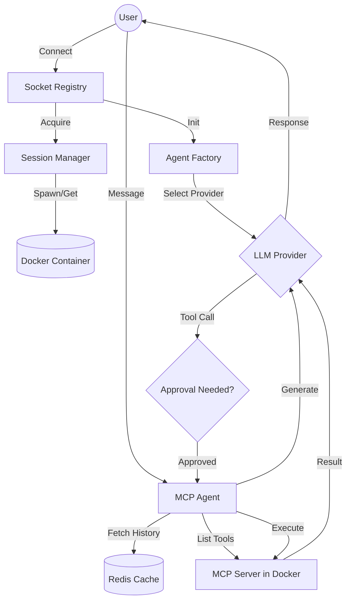

# Business Flow: MCP Orchestrator

## Overview
The MCP Orchestrator is a middleware service that enables Large Language Models (LLMs) to interact with isolated environments via the Model Context Protocol (MCP). It manages user sessions, persists conversation history, and coordinates the execution of tools within ephemeral Docker containers.

## Stakeholder Journey
1. **User Connection**: A user (or client application) connects via WebSockets, providing a unique `sessionId`.
2. **Environment Provisioning**: The system acquires a dedicated Docker container for the session. If the container doesn't exist, it is spawned automatically.
3. **Agent Personalization**: Based on the `LLM_PROVIDER` configuration, the system instantiates an agent (Gemini, Claude, or ChatGPT).
4. **Conversational Loop**:
    - User sends a prompt.
    - Agent retrieves conversation history from Redis.
    - Agent discovers available tools within the Dockerized MCP server.
    - LLM generates a response or requests a tool execution.
5. **Human-in-the-Loop (HITL)**: If a tool execution is requested, the system pauses for user approval.
6. **Tool Execution**: Upon approval, the tool is executed inside the secure container, and results are fed back to the LLM.

## Logical Flow Chart

