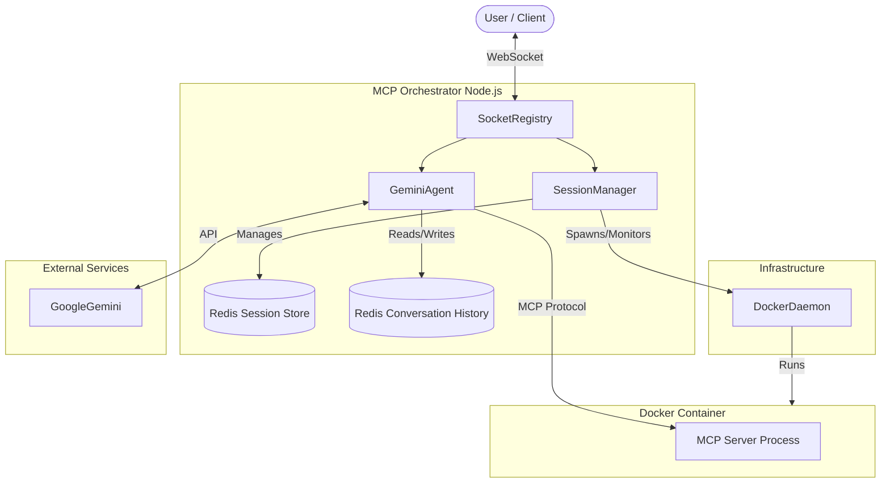

# Business Flow & Stakeholder Overview

## Narrative Overview
The **MCP Orchestrator** acts as a secure bridge between a user (Client) and an isolated execution environment (MCP Server). Its primary goal is to enable LLM-driven interactions that can safely execute code or tools within a sandboxed Docker container.

1.  **Session Initiation**: A user connects via a WebSocket. The system checks for an active session. If none exists, the **SessionManager** provisions a new secure Docker container running the MCP Server.
2.  **Agent Loop**: The **GeminiAgent** acts as the brain. It forwards user queries to Google's Gemini model.
3.  **Tool Discovery & Execution**: The Agent queries the MCP Server (running in Docker) for available tools. If the model decides to use a tool, the system pauses and requests **User Approval**.
4.  **Execution & Feedback**: Upon approval, the command is executed inside the Docker container via the Model Context Protocol (MCP). Results are fed back to the model for interpretation.
5.  **Response**: The final synthesized answer is streamed back to the user.

## Logic Flowchart

